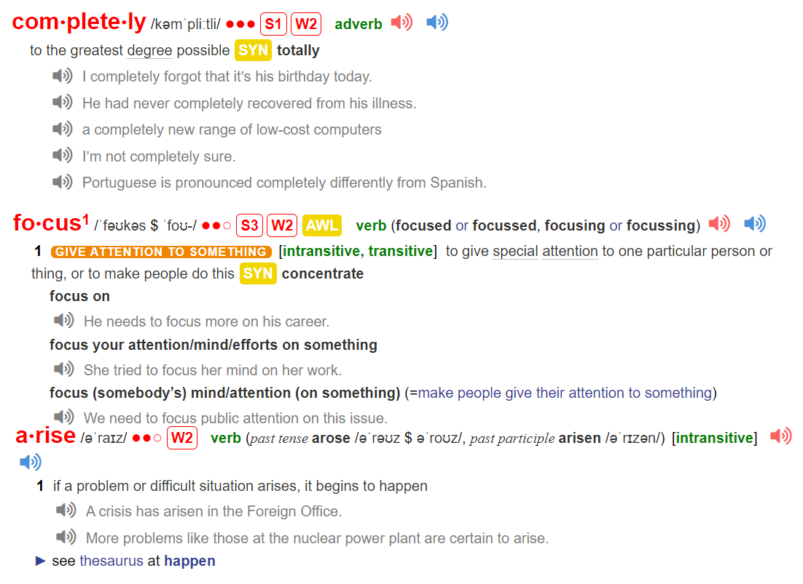

Now for the interesting question: If you `completely` ignored your
goals and `focused` only on your system, would you still succeed? For
example, if you were a basketball coach and you ignored your goal to
win a championship and focused only on what your team does at
practice each day, would you still get results?

I think you would.

The goal in any sport is to finish with the best score, but it would be
ridiculous to spend the whole game staring at the scoreboard. The only
way to actually win is to get better each day. In the words of three-time
Super Bowl winner Bill Walsh, “The score takes care of itself.” The
same is true for other areas of life. If you want better results, then
forget about setting goals. Focus on your system instead.
What do I mean by this? Are goals completely useless? Of course
not. Goals are good for setting a direction, but systems are best for
making progress. A handful of problems `arise` when you spend too
much time thinking about your goals and not enough time designing
your systems.

---
现在是一个有趣的问题：如果你完全忽略了你的目标，只专注于你的系统，你是否仍然能够成功？举个例子，如果你是一位篮球教练，你忽略了赢得冠军的目标，只关注你的团队每天在训练中做什么，你是否仍然能够取得成果？

我认为你会成功。

在任何体育运动中，目标是以最好的成绩结束比赛，但是整场比赛都盯着计分板看是荒谬的。真正取得胜利的唯一途径是每天变得更好。用三次超级碗冠军得主比尔·沃尔什（Bill Walsh）的话说，“分数会自己照顾好自己。”生活的其他领域也是如此。如果你想要更好的结果，那就忘掉设定目标，而是专注于你的系统。

这是什么意思呢？目标完全没有用吗？当然不是。`目标有助于设定方向，但是系统最适合实现进步。`当你花太多时间思考目标而不是足够时间设计系统时，就会出现一些问题。

---

 

[video](https://www.bilibili.com/video/BV1ms4y1D7LE/?spm_id_from=333.999.0.0)

---
ignore的同义词
neglect
dismiss
take no notice of

看
stare
look
glance
stave
gaze

ridiculous

in the words of

useless
worthless
valueless
- priceless
  
make progress
in progress

a handful of

arise - bad issue
occur/happen