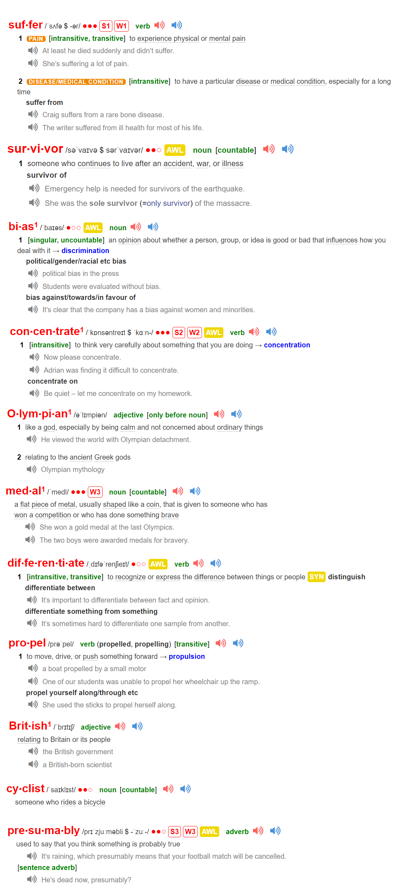

Problem #1: Winners and losers have the same goals.

Goal setting `suffers from` a serious case of `survivorship bias`. We
`concentrate` on the people who end up winning—the survivors—and
`mistakenly` assume that ambitious goals led to their success while
overlooking all of the people who had the same objective but didn’t
succeed.

Every `Olympian` wants to win a `gold medal`. Every candidate wants
to get the job. And if successful and unsuccessful people share the
same goals, then the goal cannot be what `differentiates` the winners
from the losers. It wasn’t the goal of winning the Tour de France that
`propelled` the `British cyclists` to the top of the sport. `Presumably`, they
had wanted to win the race every year before—just like every other
professional team. The goal had always been there. It was only when
they implemented a system of `continuous` small improvements that
they achieved a different outcome.

---

问题1：获胜者和失败者有相同的目标。

目标设定受到了严重的生存者偏差的影响。我们关注那些最终获胜的人——幸存者——错误地认为雄心勃勃的目标导致了他们的成功，而忽视了那些有着相同目标但没有成功的人。

每个奥运会选手都想赢得金牌。每个求职者都想得到工作。如果成功和失败的人拥有相同的目标，那么目标就不能成为区分获胜者和失败者的因素。并不是赢得环法自行车赛的目标推动了英国自行车运动员登上该项目的巅峰。可以推测，他们之前每年都想赢得比赛，就像其他职业团队一样。目标一直存在。只有当他们实施了持续的小改进系统时，他们才实现了不同的结果。

---

 

[video](https://www.bilibili.com/video/BV1qV4y1r7kE/?spm_id_from=333.999.0.0&vd_source=0d7a659e0c3fd86bc699b9150fa1cbbb)

---
Goal setting
suffer from
a serious case of
concentrate on
differentiate ... from
every years before
every other
Presumably = probably
it is ... that
---
propel -prepare