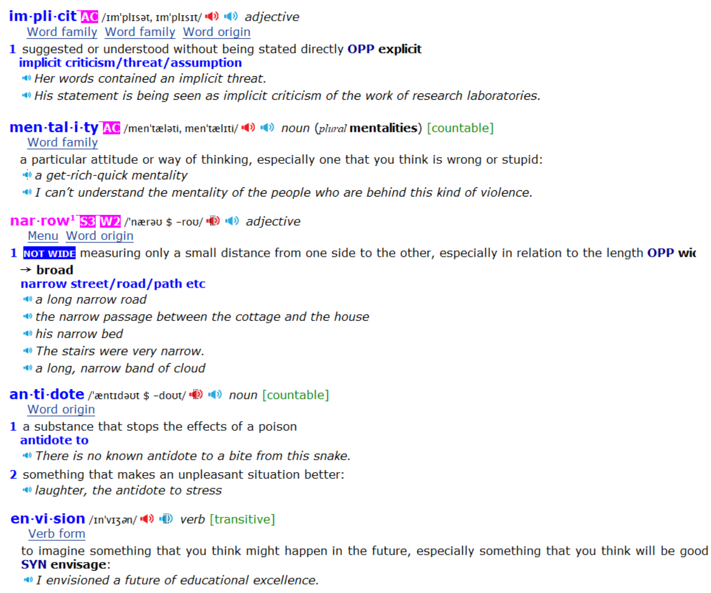

Problem #3: Goals restrict your happiness.

The `implicit` assumption behind any goal is this: “Once I reach my
goal, then I’ll be happy.” The problem with a goals-first `mentality` is
that you’re continually putting happiness off until the next milestone.
I’ve slipped into this trap so many times I’ve lost count. For years,
happiness was always something for my future self to enjoy. I
promised myself that once I gained twenty pounds of muscle or after
my business was featured in the New York Times, then I could finally
relax.

Furthermore, goals create an “either-or” conflict: either you achieve
your goal and are successful or you fail and you are a disappointment.
You `mentally` box yourself into a `narrow` version of happiness. This is
misguided. It is unlikely that your actual path through life will match
the exact journey you had in mind when you set out. It makes no sense
to restrict your satisfaction to one scenario when there are many paths
to success.

A systems-first mentality provides the `antidote`. When you fall in
love with the process rather than the product, you don’t have to wait to
give yourself permission to be happy. You can be satisfied anytime
your system is running. And a system can be successful in many
different forms, not just the one you first `envision`.

---

问题3：目标限制了你的幸福感。

任何目标背后的隐含假设是：“一旦我达到目标，我就会幸福。”目标至上的心态的问题在于，你不断地将幸福拖延到下一个里程碑。我已经陷入这个陷阱太多次，已经数不清了。多年来，幸福一直是我未来的自己才能享受的东西。我向自己保证，一旦我增加了二十磅的肌肉或者我的事业被纽约时报报道，我就可以放松了。

此外，目标会产生“非此即彼”的冲突：要么你实现了目标并取得成功，要么你失败了并成为一个失望的人。你在心理上把自己限制在幸福的狭窄版本中。这是错误的。当你制定计划时，实际上的人生路径很可能与你出发时设想的完全不同。把满足感限制在一个场景上是没有意义的，因为通往成功的道路有很多种。

系统至上的心态提供了解药。当你爱上过程而不是结果时，你不必等待才给自己幸福的许可。只要你的系统在运行，你就可以感到满足。而且一个系统可以以多种不同的形式取得成功，不仅仅是你最初设想的那种形式。

---
 
envision invention

---
set out
path - pace
fail - fall